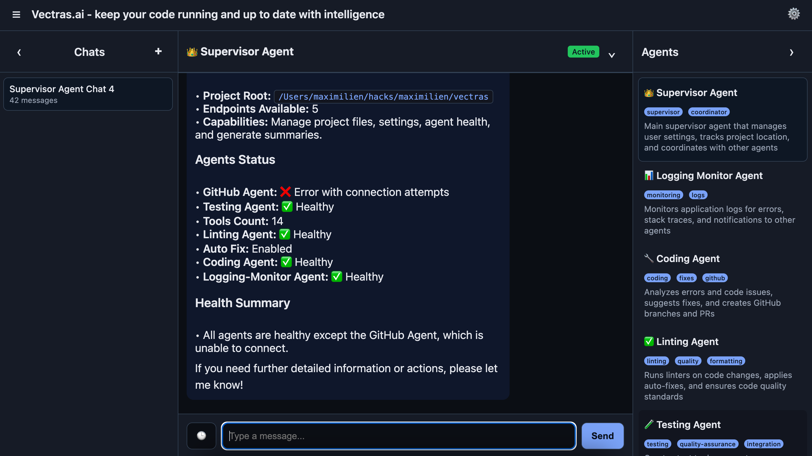
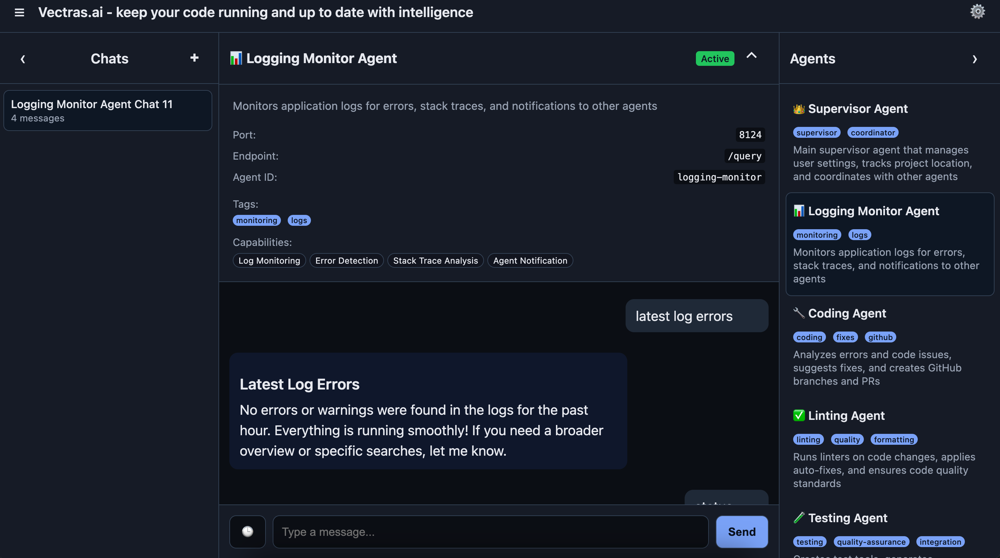

<!--
To generate PDF or HTML from this presentation:
npx @marp-team/marp-cli@latest PRESENTATION.md -o ~/Desktop/vectras.pdf
npx @marp-team/marp-cli@latest PRESENTATION.md -o ~/Desktop/vectras.html

For HTML with speaker notes:
npx @marp-team/marp-cli@latest PRESENTATION.md --html --allow-local-files -o ~/Desktop/vectras.html
-->

# Vectras: Multi-Agent AI System
## Automated Code Testing & Error Detection

**Maximilien.ai** 

---

# 🤖 What is Vectras?

A **multi-agent AI system** that automates:
- **Code testing** with intentional bugs
- **Error detection** in application logs  
- **Automated fixes** and code improvements
- **Version control** operations

**6 specialized AI agents** working together to create a complete development workflow, all built with OpenAI Agents SDK.

---

# 🏗️ Architecture Overview

```
┌─────────────────┐    ┌─────────────────┐    ┌─────────────────┐
│   Testing       │    │   Logging       │    │   Coding        │
│   Agent         │    │   Monitor       │    │   Agent         │
│   (Port 8126)   │    │   (Port 8124)   │    │   (Port 8125)   │
└─────────────────┘    └─────────────────┘    └─────────────────┘
         │                       │                       │
         └───────────────────────┼───────────────────────┘
                                 │
                    ┌─────────────────┐    ┌─────────────────┐
                    │   Linting       │    │   GitHub        │
                    │   Agent         │    │   Agent         │
                    │   (Port 8127)   │    │   (Port 8128)   │
                    └─────────────────┘    └─────────────────┘
                                 │
                    ┌─────────────────┐
                    │   Supervisor    │
                    │   Agent         │
                    │   (Port 8123)   │
                    └─────────────────┘
```

**Real-time coordination** between agents with OpenAI-powered intelligence.

---

# 🎨 Modern Frontend Interface

**Polished UI/UX for seamless agent interaction**

**Key Features:**
- **Collapsible Panes**: Maximize chat space
- **Recent Messages**: Quick access to conversation history
- **Visual Indicators**: Agent icons and typing animations
- **Smart Scrolling**: Remembers position per conversation
- **Real-time Status**: Live agent health monitoring

**Configurable via `config.yaml`** for custom default queries.

## 🖼️ New Frontend Interface

### Modern Three-Pane Layout

<div style="display: flex; justify-content: center; margin: 20px 0;">
  
</div>

**Key Features:**
- **Left Sidebar**: Chat history with collapsible design
- **Center**: Main chat area with markdown support
- **Right Sidebar**: Document management with D3.js visualizations
- **Real-time Updates**: WebSocket communication for live interactions

---

## 📊 Agent Management & Visualizations

### Interactive Agent Dashboard

<div style="display: flex; justify-content: center; margin: 20px 0;">
  
</div>

**Advanced Features:**
- **System status**: Get status of entire system at once
- **Agent satus**: Agent card to see each agent status
- **Agent chat**: Chat to each agent individually
- **Smart chat**: Remember recent conversation and easily ask query again

---

## 📊 System Configuration Visualizations

### See Current System Configuration

<div style="display: flex; justify-content: center; margin: 20px 0;">
  
</div>

**Advanced Features:**
- **Agent config**: See configuration of each agent

---

# 🔍 Logging Monitor Agent

**Real-time error detection and analysis with enhanced response formatting**

**Monitors for patterns:**
- `ERROR` - Application errors
- `Exception` - Python exceptions  
- `Traceback` - Stack traces
- `FATAL` - Critical failures
- `CRITICAL` - System issues

**Features:**
- ✅ Intelligent content type detection with LLM fallback
- ✅ Structured markdown responses for optimal frontend rendering
- ✅ Built with OpenAI Agents SDK for enhanced capabilities
- ✅ Automatically triggers handoffs to coding agent when issues are detected

---


---

# 🧪 Testing Agent

**Creates and manages test tools with intentional bugs**

```python
def divide(n1, n2):
    # Intentional bug: divides by 0 instead of n2
    return n1 / 0  # This will cause an error!
```

**Capabilities:**
- ✅ Creates test tools in Python, JavaScript, Bash
- ✅ Introduces controlled bugs for testing
- ✅ Generates integration tests
- ✅ Coordinates with other agents

---

# 🔧 Coding Agent

**Analyzes errors and suggests automated fixes**

**Workflow:**
1. **Receives error** from log monitor
2. **Analyzes code** and stack traces
3. **Suggests fixes** with explanations
4. **Creates GitHub branches** with fixes
5. **Coordinates** with testing & linting agents

**Result:** Automated pull requests with tested fixes.

---

# 📊 Linting Agent

**Ensures code quality and consistency**

**Supported tools:**
- **Python:** ruff, black
- **JavaScript:** eslint, prettier  
- **Bash:** shellcheck

**Features:**
- ✅ Code quality checks
- ✅ Formatting suggestions
- ✅ Auto-fix capabilities
- ✅ Integration with CI/CD

---

# 🚀 GitHub Agent

**Manages version control operations**

**Automated workflows:**
- **Branch creation** for fixes
- **Commit management** with proper messages
- **Pull request creation** with descriptions
- **Repository operations** and maintenance

**Seamless integration** with coding agent for automated PRs.

---

# 🧪 End-to-End Testing

**Comprehensive test suite with real OpenAI**

```bash
# Run complete e2e test
python tests/integration/run_e2e_test.py

# Results: ✅ All agents working together
# - Agent communication tested
# - Error detection verified  
# - Code analysis validated
# - Version control tested
```

**32-second test time** with real AI responses.

---

# 🎯 Key Achievements

**✅ Multi-Agent System**
- 5 specialized agents working together
- Real-time coordination and handoffs
- OpenAI-powered intelligence

**✅ Comprehensive Testing**
- End-to-end integration tests
- Real OpenAI integration
- Automated test workflows

**✅ Production Ready**
- Health monitoring
- Error handling
- Configuration management

---

# 🚀 Next Steps

**Immediate priorities:**
1. **Fix tool creation** system in testing agent
2. **Implement real agent handoffs** 
3. **Add error simulation** tests
4. **Create production deployment**

**Future vision:**
- Web-based agent management
- CI/CD integration
- Multi-language support
- Plugin ecosystem

**GitHub:** [vectras](https://github.com/maximilien/vectras)

---

# Thank You! 🎉

**Questions?** Let's discuss the future of AI-powered development!

**Demo:** Run `python tests/integration/run_e2e_test.py` to see it in action.

**Contact:** vectras@maximilien.ai
